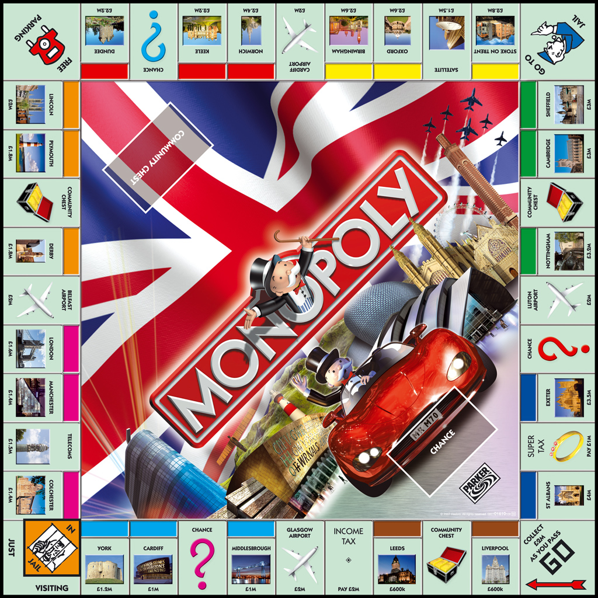

# Monopoly Simulator

<p align="center">

</p>

## Description
This repository shows the implementation of the popular board game monopoly. The objective is so bankrupt your opposition through interactive gameplay by purchasing as many properties and houses as possible. Each player starts with $1500 US version or $15 million in UK Version. Spend wisely and aim for the top! 

<p align="center">
<h3>US Board<h3>

</p>
  
<p align="center">
<h3>UK Board<h3>

</p>

## Authors
[@Anthony Massaad](https://github.com/tony1bally) \
[@Max Curkovic](https://github.com/maxcurkovic) \
[@Kareem El-Hajjar](https://github.com/KareemEH) \
[@Cory Helm](https://github.com/CoryH99)

## Running the program
When using the Jar File, ensure that the savedXML.xml, NewBoardModel.xml, and UKBoardModel.xml files are within the same folder as the jar file.
Otherwise, within IDE, everything can stay as is. 

In Jar File
- Simply double click the jar or alternatively, inside command line, ```java -jar 3110Project.jar```

In IDE
- Simply click the run button. 

## Steps to running a game
- Once the program is running, you can choose to either load an existing saved file, or load whichever version you wish to play
- To launch a new game select: ```New Game -> "version type"```
- To launch a saved game select: ```Load Recent Game```

For explanation on the rules of the program, please refer to the [user manual](https://github.com/tony1bally/3110MonopolyProject/blob/master/Documentations/User%20Manual%20.pdf).
 
## Monopoly Design Decision
This project is developed through the implementation of Model-View-Controller (MVC)

- Here is the UML diagram of the project:
<p align="center">
    
</p>

- For the logic of the game, please refer to the Sequence diagram [here](https://github.com/tony1bally/3110MonopolyProject/tree/master/UML%20Diagrams).
- For the overall design descisions for the project, please refer to the Design Descriptions [here](https://github.com/tony1bally/3110MonopolyProject/blob/master/Documentations/DesignDescriptions_M4.pdf).
  
## Workplan ahead/To be implemented
- Implementation of Chance and Chest
- Making game more appealing (i.e., Player side panel, game board, player pieces)
- Adding housing and hotel images on properties when purchased
- Adding more customizatin to the board setup for the player icons and background colours.

## CREDITS
Authors: Anthony Massaad, Max Curkovic, Kareem El-Hajjar, and Cory Helm

Copyright © 2021. All rights reserved
